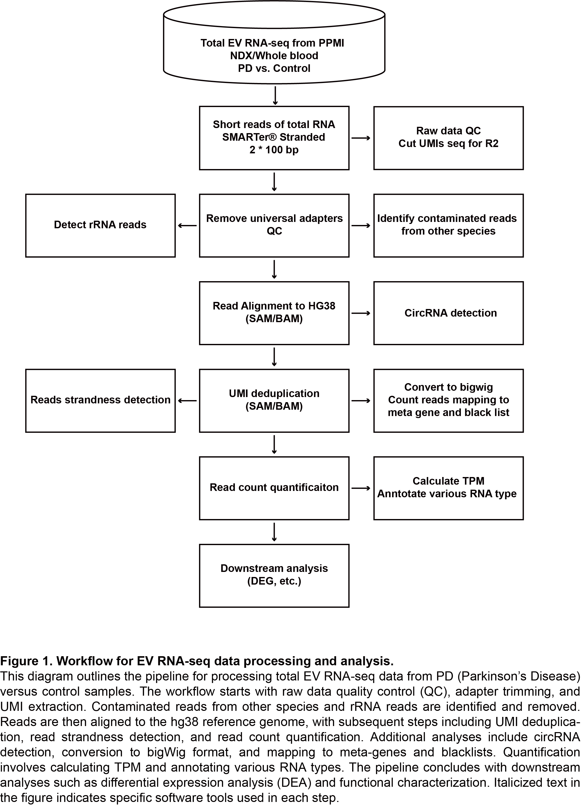

# Manual of the EVscope pipeline 
This pipeline ": run_SMARTer_pipe_EV_RNA_seq_v3.sh" processes SMARTer Stranded EV RNA-seq data from raw FASTQ files through multiple steps, 
including quality control, UMI extraction, adapter/quality trimming, rRNA detection, alignment, 
deduplication, and final feature counting. It also provides a 14-bp motif analysis of Read2, 
as well as optional bigWig coverage tracks and circular RNA detection (CIRCexplorer2).

## 1. Usage:
bash EVscope.sh <SampleName> <R1.fastq.gz> <R2.fastq.gz>
- SampleName: A short identifier or prefix of your fastq name, e.g. Sample_007.fq.gz, you can put SampleName as Sample_007
- R1.fastq.gz: Path to Read1 FASTQ file.
- R2.fastq.gz: Path to Read2 FASTQ file.
Then it will run all the modules in the current directory <SampleName>.

## 2. Requirements:
- Linux systerm on your computor of cloud server. such as mac-os termial or unbuntu environment
- Tools: fastqc, multiqc, umi_tools, cutadapt, trim_galore, ribodetector_cpu, seqtk, 
kraken2, KronaTools, kreport2krona.py, STAR, samtools, bamCoverage, 
computeMatrix, plotProfile, featureCounts, CIRCexplorer2, python scripts.

## 3. Description of Steps:
 
 
- Step 1: QC + 14-bp R2 motif with get_SMARTer_Read2_14BP_motif.py
- Step 2: UMI extraction + adapter trimming
- Step 3: rRNA detection (ribodetector_cpu)
- Step 4: Kraken classification
- Step 5: STAR alignment
- Step 6: UMI dedup
- Step 7: bigWig coverage and DeepTools
- Step 8: featureCounts
- Step 9: CIRCexplorer2

## 4. Example Command:
bash run_SMARTer_pipe_EV_RNA_seq_v3_ZYY.sh B4_TDP43_KD_caRNA_rep3 R1.fq.gz R2.fq.gz

## 5. Output Structure:
- 1_raw_QC_and_motif/: QC reports + motif results
- 2_UMI_trim/: trimmed data + logs
- 3_ribodetector/: rRNA reads
- 4_kraken/: downsampled fastqs + classification
- 5_STAR/: Aligned.sortedByCoord.out.bam etc.
- 6_umi_dedup_bam/: final deduplicated BAM
- 7_bw_density/: bigWig coverage + matrix + profile
- 8_featurecounts/: featureCounts
- 9_CIRCexplorer2/: back-spliced junction + annotated circular RNAs

## Enjoy your EV RNA-seq pipeline!

