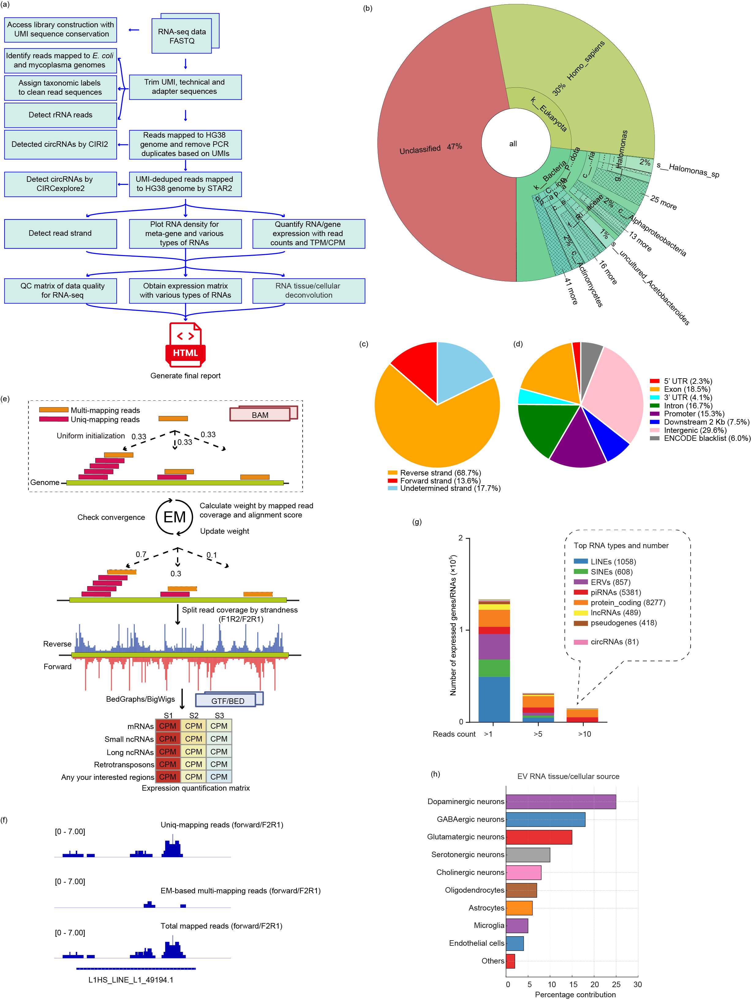

# EVscope: A Comprehensive Bioinformatics Pipeline for Accurate and Robust Total RNA Sequencing Analysis of Extracellular Vesicle 

**EVscope** is an open-source, modular bioinformatics pipeline designed for the analysis of extracellular vesicle (EV) RNA sequencing data. Tailored to address the challenges of EV RNA-seq—low RNA yield, fragmented transcripts, diverse RNA biotypes, and contamination—EVscope processes paired-end or single-end FASTQ files through a robust, end-to-end workflow. It includes quality control, UMI-based deduplication, two-pass STAR alignment, circular RNA detection, expression quantification, contamination screening, tissue deconvolution, and comprehensive reporting. Optimized for the SMARTer Stranded Total RNA-Seq Kit v3 (Pico Input), EVscope introduces a novel expectation-maximization (EM) algorithm for multi-mapping read assignment and a unique read-through detection method for Read1 trimming.

<p align="center">
  
</p>

> **Note**: If the pipeline overview image does not display, ensure `figures/EVscope_pipeline.png` is uploaded to your GitHub repository. Alternatively, use an absolute URL (e.g., from GitHub releases).

## Table of Contents

- [Key Features](#key-features)
- [Motivation](#motivation)
- [Directory Structure](#directory-structure)
- [Requirements](#requirements)
- [Installation](#installation)
- [Usage](#usage)
- [Input Data Format](#input-data-format)
- [Pipeline Steps](#pipeline-steps)
- [Output Structure](#output-structure)
- [Troubleshooting](#troubleshooting)
- [FAQ](#faq)
- [Contributing](#contributing)
- [Feedback](#feedback)
- [Citation](#citation)
- [Credits](#credits)
- [License](#license)
- [Contact](#contact)

## Key Features

- **Novel Read-Through Detection**: Trims UMI-derived adapter sequences from Read1 using reverse-complemented Read2 UMIs (`bin/Step_03_UMIAdapterTrimR1.py`).
- **EM-Based Multi-Mapping Resolution**: Assigns multi-mapped reads at single-base resolution using a genome-wide expectation-maximization algorithm (`bin/Step_25_EMapper.py`).
- **Comprehensive RNA Annotation**: Supports 3,659,642 RNAs across 20 biotypes (e.g., protein-coding, lncRNAs, miRNAs, piRNAs, retrotransposons) from GENCODE v45, piRBase v3.0, and RepeatMasker.
- **Dual circRNA Detection**: Integrates CIRCexplorer2 and CIRI2 for robust circular RNA identification, with merged results for enhanced sensitivity (`bin/Step_10_circRNA_merge.py`).
- **Tissue Deconvolution**: Infers EV RNA cellular origins using GTEx v10 and Human Brain Cell Atlas v1.0 references (`bin/Step_22_run_RNA_deconvolution_ARIC.py`).
- **Contamination Screening**: Filters bacterial (BBSplit) and microbial (Kraken2) contamination, with optional genomic DNA correction via strand-specific subtraction.
- **Extensive Quality Control**: Validates raw and trimmed FASTQs (FastQC), UMI motifs, and alignment metrics (`bin/Step_24_generate_QC_matrix.py`).
- **Expression Quantification**: Produces TPM/CPM matrices using featureCounts and RSEM, with RNA distribution visualizations (`bin/Step_15_plot_RNA_distribution_*.py`).
- **Interactive Reporting**: Generates bigWig tracks, density plots, and a comprehensive HTML report via R Markdown (`bin/Step_27_html_report.Rmd`).
- **Reproducibility**: Single-command Bash script with Conda environments, containerization support, and detailed logging.

## Motivation

Extracellular vesicles (EVs) are critical mediators of intercellular communication, carrying diverse RNAs that serve as potential biomarkers for diseases like cancer and neurodegeneration. However, EV RNA sequencing faces unique challenges: low RNA abundance, fragmented transcripts, contamination from genomic DNA or bacterial RNA, and the presence of non-polyadenylated RNAs (e.g., miRNAs, lncRNAs). Standard RNA-seq pipelines, designed for cellular RNA, often fail to address these issues, leading to unreliable results due to multi-mapping reads, incomplete RNA annotations, or unfiltered contaminants.

EVscope provides a specialized, end-to-end pipeline optimized for EV total RNA-seq. By integrating innovative algorithms, comprehensive RNA annotations, and robust quality control, EVscope delivers accurate, reproducible results, enabling biomarker discovery and advancing EV research.

## Directory Structure

The EVscope repository is organized as follows:

```
EVscope/
├── EVscope.conf                                # Configuration file for tool and reference paths
├── EVscope.sh                                  # Main pipeline script (v2.4.0)
├── README.md                                   # This documentation
├── bin/                                        # Custom scripts for pipeline steps
│   ├── Step_02_calculate_ACC_motif_fraction.py  # Calculates ACC motif fractions
│   ├── Step_02_plot_fastq2UMI_motif.py         # Visualizes UMI motif distributions
│   ├── Step_03_plot_fastq_read_length_dist.py  # Plots read length distributions
│   ├── Step_03_UMIAdapterTrimR1.py             # Trims UMI-derived adapters
│   ├── Step_07_bam2strand.py                   # Determines library strandedness
│   ├── Step_08_convert_CIRCexplorer2CPM.py     # Normalizes CIRCexplorer2 circRNA output
│   ├── Step_09_convert_CIRI2CPM.py             # Normalizes CIRI2 circRNA output
│   ├── Step_10_circRNA_merge.py                # Merges circRNA results
│   ├── Step_13_gDNA_corrected_featureCounts.py # Generates gDNA-corrected counts
│   ├── Step_15_combine_total_RNA_expr_matrix.py # Combines RNA expression matrices
│   ├── Step_15_featureCounts2TPM.py            # Converts featureCounts to TPM
│   ├── Step_15_plot_RNA_distribution_1subplot.py  # RNA distribution plots (1 subplot)
│   ├── Step_15_plot_RNA_distribution_2subplots.py # RNA distribution plots (2 subplots)
│   ├── Step_15_plot_RNA_distribution_20subplots.py # RNA distribution plots (20 subplots)
│   ├── Step_15_plot_top_expressed_genes.py     # Plots top expressed genes
│   ├── Step_17_RSEM2expr_matrix.py             # Converts RSEM to expression matrix
│   ├── Step_18_plot_reads_mapping_stats.py     # Visualizes genomic region mapping
│   ├── Step_22_run_RNA_deconvolution_ARIC.py   # Performs tissue deconvolution
│   ├── Step_24_generate_QC_matrix.py           # Compiles QC metrics
│   ├── Step_25_bigWig2CPM.py                   # Converts bigWig to CPM
│   ├── Step_25_EMapper.py                      # EM-based read coverage estimation
│   ├── Step_26_density_plot_over_meta_gene.sh  # Density plots for meta-gene regions
│   ├── Step_26_density_plot_over_RNA_types.sh  # Density plots for RNA types
│   └── Step_27_html_report.Rmd                 # Generates HTML report
├── example_data/                               # Test datasets and run script
│   ├── CIRIerror.log                           # CIRI2 error log
│   ├── Example_Data/                           # Test FASTQ files
│   │   ├── chr21_2000_reads_R1_001.fastq.gz
│   │   └── chr21_2000_reads_R2_001.fastq.tgz
│   ├── Example_Data_EVscope_output/            # Sample output
│   ├── nohup.out                               # Execution log
│   ├── processing.log                          # Processing log
│   └── run_EVscope.sh                          # Example run script
├── figures/                                    # Pipeline visualization
│   └── EVscope_pipeline.png                    # Pipeline overview image
├── references/                                 # Reference genomes, annotations, and indices
│   ├── annotations_HG38/                       # Human genome annotations
│   │   ├── 3659642_HG38_geneID_Symbol_RNAtype_with_gold_standard_piRNAs.tsv
│   │   ├── gencode.v45.chr_patch_hapl_scaff.annotation_UCSC.gtf
│   │   ├── HG38_3UTR_noOverlap.saf
│   │   ├── HG38_5UTR_noOverlap.saf
│   │   ├── HG38_downstream_2kb_noOverlap.saf
│   │   ├── HG38_exon_noOverlap.saf
│   │   ├── HG38_intergenic_noOverlap.saf
│   │   ├── HG38_intron_noOverlap.saf
│   │   ├── HG38_promoter_1500_500bp_noOverlap.saf
│   │   ├── Encode_hg38-blacklist.v2.bed
│   │   └── GeneCodeV45_combined_Nucl_Mt_rRNA_589.interval_list
│   ├── deconvolution_HG38/                     # Deconvolution reference matrices
│   │   ├── GTEx_v10_SMTS_AVG_TPM.csv
│   │   ├── GTEx_v10_SMTSD_AVG_TPM.csv
│   │   └── human_brain_single_cell_atlasV1_31superclusters_AVP_CPM.csv
│   ├── genome/                                # Reference genomes
│   │   ├── hg38/
│   │   │   └── hg38.p14.whole.genome.fa
│   │   ├── ecoli/
│   │   │   └── E.coli_ge.fa
│   │   └── mycoplasma/
│   │       └── mycoplasma_ge.fa
│   └── index/                                 # Aligner indices
│       ├── Index_BWA_V0.7.18/
│       ├── Index_STAR-2.7.10b_sjdbOverhang99_GeneCode45/
│       └── RSEM_bowtie2_index/
├── soft/                                       # Bundled external tools
│   ├── bbmap                                   # BBMap tools
│   ├── CIRI_v2.0.6                             # CIRI2 for circRNA detection
│   ├── kraken2                                 # Kraken2 for taxonomic classification
│   ├── KrakenTools                             # Kraken2 helper scripts
│   └── RSEM_v1.3.3                             # RSEM for quantification
```

## Requirements

### Software
- **Operating System**: Linux (e.g., Ubuntu 20.04+) or macOS.
- **Bash**: Version 4.0 or higher.
- **Conda**: Miniconda or Anaconda for environment management.
- **Core Tools**:
  - FastQC (v0.12.1)
  - umi_tools (v1.1.5)
  - cutadapt (v4.9)
  - STAR (v2.7.11b)
  - samtools (v1.21)
  - featureCounts (v2.0.6)
  - CIRCexplorer2 (v2.3.8)
  - CIRI2 (v2.0.6, in `soft/`)
  - RSEM (v1.3.3, in `soft/`)
  - BBMap (v39.15, in `soft/`)
  - Kraken2 (in `soft/`)
  - KronaTools
  - ribodetector (v0.3.1)
  - seqtk (v1.4)
  - BWA (v0.7.18)
  - Picard (v3.3.0)
  - deepTools (v3.5.5)
  - R (v4.3.1) with packages:
    - `rmarkdown` (v2.29)
    - `DT` (v0.33)
    - `kableExtra` (v1.4.0)
    - `bookdown` (v0.42)
    - `ggplot2` (v3.5.1)
    - `dplyr` (v1.1.4)
  - Python (v3.10.0) with packages:
    - `pandas` (v2.2.3)
    - `numpy`
    - `matplotlib` (v3.9.1)
    - `biopython` (v1.78)
    - `numba` (v0.60.0)
    - `pyBigWig` (v0.3.22)
    - `pysam`

### Reference Files
- **Genomes**:
  - Human: `references/genome/hg38/hg38.p14.whole.genome.fa`
  - Mycoplasma: `references/genome/mycoplasma/mycoplasma_ge.fa`
  - E. coli: `references/genome/ecoli/E.coli_ge.fa`
- **Indices**:
  - STAR: `references/index/Index_STAR-2.7.10b_sjdbOverhang99_GeneCode45/`
  - BWA: `references/index/Index_BWA_V0.7.18/hg38.p14.whole.genome.fa`
  - RSEM: `references/index/RSEM_bowtie2_index/RSEM_REF_HG38_3659642_RNNAs/`
- **Annotations**:
  - GENCODE v45: `references/annotations_HG38/gencode.v45.chr_patch_hapl_scaff.annotation_UCSC.gtf`
  - Comprehensive RNA: `references/annotations_HG38/HG38_3659642_combined_RNAs_with_gold_standard_piRNAs.gtf`
  - SAF/BED files: `HG38_3UTR_noOverlap.saf`, `HG38_5UTR_noOverlap.saf`, etc.
  - rRNA intervals: `references/annotations_HG38/GeneCodeV45_combined_Nucl_Mt_rRNA_589.interval_list`
- **Deconvolution References**:
  - GTEx v10: `references/deconvolution_HG38/GTEx_v10_SMTS_AVG_TPM.csv`
  - Brain Atlas: `references/deconvolution_HG38/human_brain_single_cell_atlasV1_31superclusters_AVP_CPM.csv`
- **Kraken2 Database**: `soft/kraken2/standard_krakendb/`
- **Bacterial References**: 240 Mycoplasma strains, E. coli (GCF_000005845.2_ASM584v2) in `references/genome/`

### Hardware
- **CPU**: 20+ threads recommended for optimal performance.
- **RAM**: Minimum 64 GB; 250 GB recommended for Picard tools.
- **Storage**: 500 GB+ for input data, references, and outputs.

## Installation

Follow these steps to set up EVscope:

1. **Clone the Repository**:
   ```bash
   git clone https://github.com/TheDongLab/EVscope.git
   cd EVscope
   ```

2. **Install Conda** (if not already installed):
   ```bash
   wget https://repo.anaconda.com/miniconda/Miniconda3-latest-Linux-x86_64.sh
   bash Miniconda3-latest-Linux-x86_64.sh
   source ~/.bashrc
   ```

3. **Create Conda Environments**:
   Create three environments for EVscope, Picard, and Kraken2:
   ```bash
   conda env create -f environments/evscope_env.yml
   conda env create -f environments/picard_env.yml
   conda env create -f environments/kraken2_env.yml
   ```
   Example `environments/evscope_env.yml`:
   ```yaml
   name: evscope_env
   channels:
     - bioconda
     - conda-forge
   dependencies:
     - fastqc=0.12.1
     - umi_tools=1.1.5
     - cutadapt=4.9
     - star=2.7.11b
     - samtools=1.21
     - subread=2.0.6
     - circos
     - ribodetector=0.3.1
     - seqtk=1.4
     - bwa=0.7.18
     - deeptools=3.5.5
     - python=3.10.0
     - pandas=2.2.3
     - numpy
     - matplotlib=3.9.1
     - biopython=1.78
     - numba=0.60.0
     - pybigwig=0.3.22
     - pysam
     - r-base=4.3.1
     - r-rmarkdown=2.29
     - r-dt=0.33
     - r-kableextra=1.4.0
     - r-bookdown=0.42
     - r-ggplot2=3.5.1
     - r-dplyr=1.1.4
   ```
   Create similar YAML files for:
   - `picard_env.yml`: Includes `picard` (v3.3.0) and `imagemagick`.
   - `kraken2_env.yml`: Includes `kraken2` and `krona`.

4. **Install CIRCexplorer2**:
   ```bash
   conda activate evscope_env
   pip install CIRCexplorer2==2.3.8
   ```

5. **Verify Bundled Tools**:
   Ensure bundled tools are present in `soft/`:
   ```bash
   ls soft/bbmap
   ls soft/CIRI_v2.0.6
   ls soft/RSEM_v1.3.3
   ls soft/kraken2
   ```

6. **Download Reference Files**:
   Organize genomes, indices, and annotations in `references/`:
   ```bash
   mkdir -p references/{genome/{hg38,ecoli,mycoplasma},annotations_HG38,deconvolution_HG38,index}
   # Example: Download hg38 genome
   # wget -O references/genome/hg38/hg38.p14.whole.genome.fa <URL>
   ```
   Reference files are available at [EVscope GitHub Releases](https://github.com/TheDongLab/EVscope/releases).

7. **Set Up Kraken2 Database**:
   ```bash
   mkdir -p soft/kraken2/standard_krakendb
   conda activate kraken2_env
   kraken2-build --standard --db soft/kraken2/standard_krakendb --threads 20
   ```

8. **Test Installation**:
   Verify key tools:
   ```bash
   conda activate evscope_env
   fastqc --version
   STAR --version
   samtools --version
   python --version
   CIRCexplorer2 --version
   ```

9. **Upload Pipeline Image**:
   Ensure the pipeline overview image is in the repository:
   ```bash
   mkdir -p figures
   # Copy EVscope_pipeline.png to figures/
   ```
   Commit and push to GitHub:
   ```bash
   git add figures/EVscope_pipeline.png
   git commit -m "Add pipeline overview image"
   git push origin main
   ```

## Usage

### Command Syntax
```bash
bash EVscope.sh --sample_name <name> --input_fastqs <files> [options]
```

**Required Arguments**:
- `--sample_name <name>`: Unique sample identifier (used for output files).
- `--input_fastqs <files>`: Comma-separated FASTQ file paths (e.g., `R1.fq.gz,R2.fq.gz` for paired-end).

**Optional Arguments**:
| Option | Description | Default |
|--------|-------------|---------|
| `--threads <int>` | Number of CPU threads | 1 |
| `--run_steps <list>` | Steps to run (e.g., `1,3,5-8`, `all`) | `all` |
| `--skip_steps <list>` | Steps to skip (e.g., `2,4`) | None |
| `--circ_tool <tool>` | circRNA detection tool (`CIRCexplorer2`, `CIRI2`, `both`) | `both` |
| `--read_count_mode <mode>` | Read counting strategy (`uniq` for featureCounts, `multi` for RSEM) | `uniq` |
| `--gDNA_correction <yes\|no>` | Apply genomic DNA correction | `no` |
| `--strandedness <strand>` | Library strandedness (`forward`, `reverse`, `unstrand`) | `reverse` |
| `--config <path>` | Custom configuration file | `EVscope.conf` |
| `-V, --verbosity <level>` | Logging level (1=DEBUG, 2=INFO, 3=WARN, 4=ERROR) | 2 |
| `-h, --help` | Display help message | - |
| `-v, --version` | Show pipeline version (v2.4.0) | - |

### Example: Full Pipeline
Run all steps for a paired-end sample:
```bash
bash EVscope.sh --sample_name Example_Data \
    --input_fastqs example_data/Example_Data/chr21_2000_reads_R1_001.fastq.gz,example_data/Example_Data/chr21_2000_reads_R2_001.fastq.tgz \
    --threads 20 \
    --run_steps all \
    --gDNA_correction yes \
    --strandedness reverse \
    --verbosity 2
```

### Example: Specific Steps
Run steps 1-3 for quality control:
```bash
bash EVscope.sh --sample_name Test_Sample \
    --input_fastqs test_R1.fq.gz,test_R2.fq.gz \
    --threads 10 \
    --run_steps 1-3
```

### Test Run with Example Data
Use the provided test dataset:
```bash
cd example_data
bash run_EVscope.sh
```

### Configuration File
Edit `EVscope.conf` to specify absolute paths to tools, genomes, indices, and annotations. Example:
```bash
# Core Paths
EVscope_PATH="/home/user/EVscope"
# Tool Paths
CIRI2_PERL_SCRIPT="${EVscope_PATH}/soft/CIRI_v2.0.6/CIRI2.pl"
BBSPLIT_SCRIPT="${EVscope_PATH}/soft/bbmap/bbsplit.sh"
# Reference Genomes
HUMAN_GENOME_FASTA="${EVscope_PATH}/references/genome/hg38/hg38.p14.whole.genome.fa"
# Annotations
TOTAL_GENE_GTF="${EVscope_PATH}/references/annotations_HG38/HG38_3659642_combined_RNAs_with_gold_standard_piRNAs.gtf"
```

> **Note**: Ensure all paths in `EVscope.conf` are absolute and files exist. The pipeline validates essential references before execution.

## Input Data Format

- **FASTQ Files**: Gzipped, paired-end (`R1.fastq.gz`, `R2.fastq.gz`) or single-end (`R1.fastq.gz`).
- **Sequencing Protocol**: Optimized for SMARTer Stranded Total RNA-Seq Kit v3 (Pico Input) with 14-bp UMIs in Read2.
- **Naming Convention**: R1 and R2 files should share a common prefix (e.g., `Sample_001_R1.fastq.gz`, `Sample_001_R2.fastq.gz`).
- **Quality**: High-quality reads suitable for EV RNA-seq.

> **Warning**: For non-SMARTer-seq data, adjust UMI parameters in `bin/Step_02_*.py` and `bin/Step_03_UMIAdapterTrimR1.py`.

## Pipeline Steps

EVscope comprises 27 modular steps for comprehensive EV RNA-seq analysis:

| Step | Description | Output Directory |
|------|-------------|------------------|
| 1 | Raw FASTQ quality control using FastQC | `Step_01_Raw_QC` |
| 2 | UMI motif analysis and ACC motif fraction calculation | `Step_02_UMI_Analysis` |
| 3 | UMI extraction, adapter trimming, and read-through UMI removal | `Step_03_UMI_Adaptor_Trim` |
| 4 | Quality control of trimmed FASTQs using FastQC | `Step_04_Trimmed_QC` |
| 5 | Bacterial contamination screening (E. coli, Mycoplasma) using BBSplit | `Step_05_Bacterial_Filter` |
| 6 | Two-pass STAR alignment with UMI deduplication (initial + refined) | `Step_06_Alignment_Initial`, `Step_06_Alignment_Refined` |
| 7 | Library strandedness detection and gDNA assessment | `Step_07_Strand_Detection` |
| 8 | CIRCexplorer2-based circular RNA detection | `Step_08_CIRCexplorer2_circRNA` |
| 9 | CIRI2-based circular RNA detection using BWA alignments | `Step_09_CIRI2_circRNA` |
| 10 | Merging of CIRCexplorer2 and CIRI2 circRNA results | `Step_10_circRNA_Merge` |
| 11 | RNA-seq metrics collection using Picard | `Step_11_RNA_Metrics` |
| 12 | featureCounts quantification (unique-mapping mode) | `Step_12_featureCounts_Quant` |
| 13 | Genomic DNA-corrected featureCounts quantification | `Step_13_gDNA_Corrected_Quant` |
| 14 | RSEM quantification (multi-mapping mode) | `Step_14_RSEM_Quant` |
| 15 | featureCounts-based expression matrix and RNA distribution plots | `Step_15_featureCounts_Expression` |
| 16 | gDNA-corrected expression matrix and RNA distribution plots | `Step_16_gDNA_Corrected_Expression` |
| 17 | RSEM-based expression matrix and RNA distribution plots | `Step_17_RSEM_Expression` |
| 18 | Genomic region read mapping analysis (3'UTR, 5'UTR, introns, etc.) | `Step_18_Genomic_Regions` |
| 19 | Taxonomic classification using Kraken2 | `Step_19_Taxonomy` |
| 20 | Tissue deconvolution for featureCounts results | `Step_20_featureCounts_Deconvolution` |
| 21 | Tissue deconvolution for gDNA-corrected results | `Step_21_gDNA_Corrected_Deconvolution` |
| 22 | Tissue deconvolution for RSEM results | `Step_22_RSEM_Deconvolution` |
| 23 | rRNA detection using ribodetector | `Step_23_rRNA_Detection` |
| 24 | Comprehensive quality control summary generation | `Step_24_QC_Summary` |
| 25 | Coverage analysis and bigWig generation using EMapper | `Step_25_EMapper_BigWig_Quantification` |
| 26 | Coverage density plots for RNA types and meta-gene regions | `Step_26_BigWig_Density_Plot` |
| 27 | Final interactive HTML report generation | `Step_27_HTML_Report` |

> **Note**: Steps 13, 16, 19, 20, 21, 22, and 23 are optional and fail gracefully if inputs are unavailable or conditions are not met (e.g., `--gDNA_correction=no` skips steps 13, 16, 21).

## Output Structure

The pipeline generates a structured output directory named `<sample_name>_EVscope_output/`:

```
<sample_name>_EVscope_output/
├── EVscope_pipeline.log                              # Main pipeline log
├── EVscope_pipeline.png                              # Pipeline overview
├── Step_01_Raw_QC/                                   # FastQC reports for raw FASTQs
│   └── <sample_name>_R1_fastqc.html
├── Step_02_UMI_Analysis/                             # UMI motif plots and ACC fractions
│   └── <sample_name>_ACC_motif_fraction.tsv
├── Step_03_UMI_Adaptor_Trim/                         # Trimmed FASTQs and logs
│   └── <sample_name>_R1_clean.fq.gz
├── Step_04_Trimmed_QC/                               # FastQC reports for trimmed FASTQs
├── Step_05_Bacterial_Filter/                         # Contamination-filtered FASTQs
├── Step_06_Alignment_Initial/                        # Initial STAR alignment
├── Step_06_Alignment_Refined/                        # Final BAM files
│   └── <sample_name>_STAR_umi_dedup_Aligned.sortedByCoord.out.bam
├── Step_07_Strand_Detection/                         # Strandedness results
├── Step_08_CIRCexplorer2_circRNA/                    # CIRCexplorer2 circRNA results
├── Step_09_CIRI2_circRNA/                            # CIRI2 circRNA results
├── Step_10_circRNA_Merge/                            # Merged circRNA results
│   └── <sample_name>_combined_CIRCexplorer2_CIRI2.tsv
├── Step_11_RNA_Metrics/                              # Picard metrics
├── Step_12_featureCounts_Quant/                      # featureCounts results
├── Step_13_gDNA_Corrected_Quant/                     # gDNA-corrected counts
├── Step_14_RSEM_Quant/                               # RSEM quantification
├── Step_15_featureCounts_Expression/                 # TPM matrices and plots
│   └── <sample_name>_combined_expression_matrix_linearRNA_TPM_circRNA_CPM_featureCounts.tsv
├── Step_16_gDNA_Corrected_Expression/                # gDNA-corrected expression
├── Step_17_RSEM_Expression/                          # RSEM expression matrices
├── Step_18_Genomic_Regions/                          # Genomic region counts
├── Step_19_Taxonomy/                                 # Kraken2 classification
│   └── <sample_name>_krona.html
├── Step_20_featureCounts_Deconvolution/              # Tissue deconvolution
├── Step_21_gDNA_Corrected_Deconvolution/             # gDNA-corrected deconvolution
├── Step_22_RSEM_Deconvolution/                       # RSEM deconvolution
├── Step_23_rRNA_Detection/                           # rRNA detection results
├── Step_24_QC_Summary/                               # QC metrics matrix
│   └── <sample_name>_QC_matrix.tsv
├── Step_25_EMapper_BigWig_Quantification/            # bigWig tracks
│   └── EMapper_output/<sample_name>_final_unstranded.bw
├── Step_26_BigWig_Density_Plot/                      # Density plots
│   ├── RNA_types/
│   └── meta_gene/
└── Step_27_HTML_Report/                              # Final HTML report
    └── <sample_name>_final_report.html
```

**Key Outputs**:
- **Quality Control**: FastQC reports, UMI motif plots, QC matrix (`Step_24_QC_Summary/`).
- **FASTQ**: Trimmed reads (`Step_03_UMI_Adaptor_Trim/`).
- **Alignments**: BAM files (`Step_06_Alignment_Refined/`).
- **circRNAs**: Merged CIRCexplorer2/CIRI2 results and Venn diagrams (`Step_10_circRNA_Merge/`).
- **Expression**: TPM/CPM matrices and RNA distribution plots (`Step_15_*/`, `Step_16_*/`, `Step_17_*/`).
- **Deconvolution**: Tissue/cell type estimates (`Step_20_*/`, `Step_21_*/`, `Step_22_*/`).
- **Coverage**: bigWig tracks and density plots (`Step_25_*/`, `Step_26_*/`).
- **Report**: Interactive HTML report (`Step_27_HTML_Report/`).

## Troubleshooting

- **Command Syntax Error**:
  - Ensure correct argument order: `--sample_name`, `--input_fastqs`, etc.
  - Quote paths with spaces: `"path with spaces/fastq.gz"`.
  - Example: `bash EVscope.sh --sample_name Test --input_fastqs R1.fq.gz,R2.fq.gz`.
- **Dependency Not Found**:
  - Verify Conda environments: `conda list -n evscope_env`.
  - Activate environment: `conda activate evscope_env`.
- **Reference File Missing**:
  - Check `EVscope.conf` paths and file existence.
  - Set permissions: `chmod -R u+rw references/`.
- **Memory Issues**:
  - Picard requires up to 250 GB RAM. Reduce `--threads` or use a high-memory server.
- **Kraken2 Failure**:
  - Ensure `soft/kraken2/standard_krakendb/` exists and is built.
  - Run: `kraken2-build --standard --db soft/kraken2/standard_krakendb --threads 20`.
- **Step Skipped Unexpectedly**:
  - Check for `step.done` files: `rm Step_XX/step.done` to rerun.
- **Step Failure**:
  - Review logs: `<output_dir>/Step_XX/step.stderr.log` or `EVscope_pipeline.log`.
  - Optional steps (19, 20, 21, 22, 23) may fail gracefully if inputs are missing.
- **Image Not Displaying**:
  - Ensure `figures/EVscope_pipeline.png` is in the repository and pushed to GitHub.
  - Verify path: `./figures/EVscope_pipeline.png`.
  - Use an absolute URL if hosted elsewhere: `<https://github.com/TheDongLab/EVscope/releases/...>`.

## FAQ

**Q: Can EVscope process non-SMARTer-seq data?**  
A: Yes, modify UMI parameters in `bin/Step_02_*.py` and `bin/Step_03_UMIAdapterTrimR1.py` to match your protocol.

**Q: How do I run specific pipeline steps?**  
A: Use `--run_steps`, e.g., `--run_steps 1,3,5-8`. Skip steps with `--skip_steps`.

**Q: Why did an optional step fail?**  
A: Steps like Kraken2 or deconvolution may fail if no relevant reads are detected or references are missing. Check logs for details.

**Q: How do I view the final report?**  
A: Open `Step_27_HTML_Report/<sample_name>_final_report.html` in a web browser.

**Q: Can I use a different genome?**  
A: Yes, update `references/` with new genomes, indices, and annotations, and modify `EVscope.conf`.

**Q: How do I increase pipeline speed?**  
A: Increase `--threads` (e.g., 20) and ensure sufficient RAM (250 GB for Picard).

## Contributing

We welcome contributions to enhance EVscope! To contribute:
1. Fork the repository: [https://github.com/TheDongLab/EVscope](https://github.com/TheDongLab/EVscope).
2. Create a feature branch: `git checkout -b feature/YourFeature`.
3. Commit changes: `git commit -m 'Add YourFeature'`.
4. Push to your fork: `git push origin feature/YourFeature`.
5. Submit a pull request.

Please report bugs or suggest features via [GitHub Issues](https://github.com/TheDongLab/EVscope/issues). Follow the [Contributor Guidelines](CONTRIBUTING.md) (if available).

## Feedback

Your feedback is essential for improving EVscope! Share suggestions, issues, or questions:
- **GitHub Issues**: [https://github.com/TheDongLab/EVscope/issues](https://github.com/TheDongLab/EVscope/issues)
- **Email**: [xianjun.dong@yale.edu](mailto:xianjun.dong@yale.edu)

## Citation

If you use EVscope in your research, please cite:

> Zhao, Y., Chintalapudi, H., Xu, Z., Liu, W., Hu, Y., Grassin, E., Song, M., Hong, S., Lee, L. P., & Dong, X. (2025). EVscope: A Comprehensive Pipeline for Extracellular Vesicle RNA-Seq Analysis. *In preparation*. DOI: [10.5281/zenodo.15577789](https://doi.org/10.5281/zenodo.15577789)

## Credits

**Authors**:
- **Yiyong Zhao**: Data curation, Formal analysis, Software, Visualization
- **Himanshu Chintalapudi**: Visualization
- **Ziqian Xu**: Resources
- **Weiqiang Liu**: Data curation
- **Yuxuan Hu**: Validation
- **Ewa Grassin, Minsun Song, SoonGweon Hong, Luke P. Lee**: Resources
- **Xianjun Dong**: Conceptualization, Methodology, Funding, Supervision

**Affiliations**:
1. Department of Neurology and Biomedical Informatics and Data Science, Yale School of Medicine, Yale University, New Haven, CT, USA
2. Aligning Science Across Parkinson’s (ASAP) Collaborative Research Network, Chevy Chase, MD, USA
3. Department of Medicine, Brigham and Women’s Hospital, Harvard Medical School, Boston, MA, USA
4. Department of Bioengineering, University of California at Berkeley, Berkeley, CA, USA

**Funding**:
- NIH Grants: 1R01NS124916, 1R24NS132738
- Aligning Science Across Parkinson’s: ASAP-000301, ASAP-000529 (via Michael J. Fox Foundation)
- Dong Lab computational resources

**Corresponding Author**: Xianjun Dong ([xianjun.dong@yale.edu](mailto:xianjun.dong@yale.edu))

## License

EVscope is licensed under the [Creative Commons Attribution 4.0 International License (CC BY 4.0)](https://creativecommons.org/licenses/by/4.0/). You are free to share and adapt the material, provided you give appropriate credit, include a link to the license, and indicate any changes made. See [LICENSE](LICENSE) for details.

## Contact

For inquiries, contact:
- **Xianjun Dong**: [xianjun.dong@yale.edu](mailto:xianjun.dong@yale.edu)
- **GitHub**: [https://github.com/TheDongLab/EVscope](https://github.com/TheDongLab/EVscope)

---
