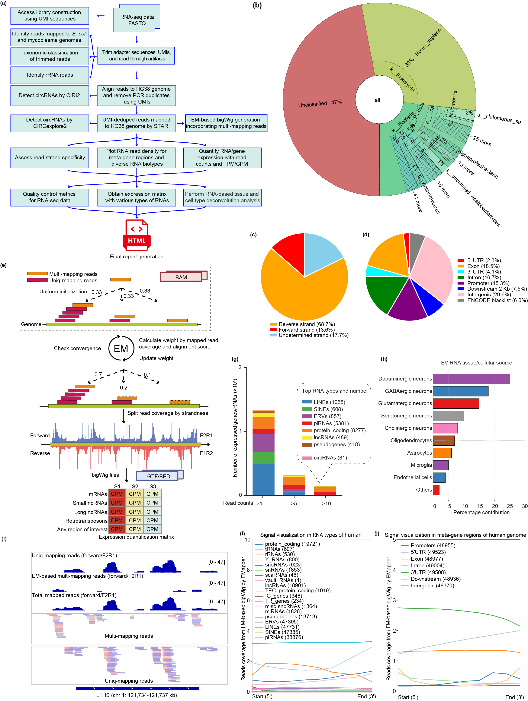

# EVscope: A Comprehensive Bioinformatics Pipeline for Accurate and Robust Total RNA Sequencing Analysis of Extracellular Vesicle

**EVscope** is an open-source, modular bioinformatics pipeline designed for the analysis of extracellular vesicle (EV) RNA sequencing data. Tailored to address the challenges of EV RNA-seq—low RNA yield, fragmented transcripts, diverse RNA biotypes, and contamination—EVscope processes paired-end or single-end FASTQ files through a robust, end-to-end workflow. It includes quality control, UMI-based deduplication, two-pass STAR alignment, circular RNA detection, expression quantification, contamination screening, tissue deconvolution, and comprehensive reporting. Optimized for the SMARTer Stranded Total RNA-Seq Kit v3 (Pico Input), EVscope introduces a novel expectation-maximization (EM) algorithm for multi-mapping read assignment and a unique read-through detection method for Read1 trimming.

<p align="center">
  
</p>

> **Note**: If the pipeline overview image does not display, ensure `figures/EVscope_pipeline.png` is uploaded to your GitHub repository. Alternatively, use an absolute URL (e.g., from GitHub releases).

## Table of Contents

- [Key Features](#key-features)
- [Motivation](#motivation)
- [Directory Structure](#directory-structure)
- [Requirements](#requirements)
- [Installation](#installation)
- [Usage](#usage)
- [Input Data Format](#input-data-format)
- [Pipeline Steps](#pipeline-steps)
- [Output Structure](#output-structure)
- [Troubleshooting](#troubleshooting)
- [FAQ](#faq)
- [Contributing](#contributing)
- [Feedback](#feedback)
- [Citation](#citation)
- [Credits](#credits)
- [License](#license)
- [Contact](#contact)

## Key Features

- **Novel Read-Through Detection**: Trims UMI-derived adapter sequences from Read1 using reverse-complemented Read2 UMIs (`bin/Step_03_UMIAdapterTrimR1.py`).
- **EM-Based Multi-Mapping Resolution**: Assigns multi-mapped reads at single-base resolution using a genome-wide expectation-maximization algorithm (`bin/Step_25_EMapper.py`).
- **Comprehensive RNA Annotation**: Supports 3,659,642 RNAs across 20 biotypes (e.g., protein-coding, lncRNAs, miRNAs, piRNAs, retrotransposons) from GENCODE v45, piRBase v3.0, and RepeatMasker.
- **Dual circRNA Detection**: Integrates CIRCexplorer2 and CIRI2 for robust circular RNA identification, with merged results for enhanced sensitivity (`bin/Step_10_circRNA_merge.py`).
- **Tissue Deconvolution**: Infers EV RNA cellular origins using GTEx v10 and Human Brain Cell Atlas v1.0 references (`bin/Step_22_run_RNA_deconvolution_ARIC.py`).
- **Contamination Screening**: Filters bacterial (BBSplit) and microbial (Kraken2) contamination, with optional genomic DNA correction via strand-specific subtraction.
- **Extensive Quality Control**: Validates raw and trimmed FASTQs (FastQC), UMI motifs, and alignment metrics (`bin/Step_24_generate_QC_matrix.py`).
- **Expression Quantification**: Produces TPM/CPM matrices using featureCounts and RSEM, with RNA distribution visualizations (`bin/Step_15_plot_RNA_distribution_*.py`).
- **Interactive Reporting**: Generates bigWig tracks, density plots, and a comprehensive HTML report via R Markdown (`bin/Step_27_html_report.Rmd`).
- **Reproducibility**: Single-command Bash script with Conda environments, containerization support, and detailed logging.

## Motivation

Extracellular vesicles (EVs) are critical mediators of intercellular communication, carrying diverse RNAs that serve as potential biomarkers for diseases like cancer and neurodegeneration. However, EV RNA sequencing faces unique challenges: low RNA abundance, fragmented transcripts, contamination from genomic DNA or bacterial RNA, and the presence of non-polyadenylated RNAs (e.g., miRNAs, lncRNAs). Standard RNA-seq pipelines, designed for cellular RNA, often fail to address these issues, leading to unreliable results due to multi-mapping reads, incomplete RNA annotations, or unfiltered contaminants.

EVscope provides a specialized, end-to-end pipeline optimized for EV total RNA-seq. By integrating innovative algorithms, comprehensive RNA annotations, and robust quality control, EVscope delivers accurate, reproducible results, enabling biomarker discovery and advancing EV research.

## Directory Structure

The EVscope repository is organized as follows:

```
EVscope/
├── EVscope.conf                                # Configuration file for tool and reference paths
├── EVscope.sh                                  # Main pipeline script (v1.0.0)
├── README.md                                   # This documentation
├── bin/                                        # Custom scripts for pipeline steps
│   ├── Step_02_calculate_ACC_motif_fraction.py  # Calculates ACC motif fractions
│   ├── Step_02_plot_fastq2UMI_motif.py         # Visualizes UMI motif distributions
│   ├── Step_03_plot_fastq_read_length_dist.py  # Plots read length distributions
│   ├── Step_03_UMIAdapterTrimR1.py             # Trims UMI-derived adapters
│   ├── Step_07_bam2strand.py                   # Determines library strandedness
│   ├── Step_08_convert_CIRCexplorer2CPM.py     # Normalizes CIRCexplorer2 circRNA output
│   ├── Step_09_convert_CIRI2CPM.py             # Normalizes CIRI2 circRNA output
│   ├── Step_10_circRNA_merge.py                # Merges circRNA results
│   ├── Step_13_gDNA_corrected_featureCounts.py # Generates gDNA-corrected counts
│   ├── Step_15_combine_total_RNA_expr_matrix.py # Combines RNA expression matrices
│   ├── Step_15_featureCounts2TPM.py            # Converts featureCounts to TPM
│   ├── Step_15_plot_RNA_distribution_1subplot.py  # RNA distribution plots (1 subplot)
│   ├── Step_15_plot_RNA_distribution_2subplots.py # RNA distribution plots (2 subplots)
│   ├── Step_15_plot_RNA_distribution_20subplots.py # RNA distribution plots (20 subplots)
│   ├── Step_15_plot_top_expressed_genes.py     # Plots top expressed genes
│   ├── Step_17_RSEM2expr_matrix.py             # Converts RSEM to expression matrix
│   ├── Step_18_plot_reads_mapping_stats.py     # Visualizes genomic region mapping
│   ├── Step_22_run_RNA_deconvolution_ARIC.py   # Performs tissue deconvolution
│   ├── Step_24_generate_QC_matrix.py           # Compiles QC metrics
│   ├── Step_25_bigWig2Expression.py            # Converts bigWig to CPM/TPM
│   ├── Step_25_EMapper.py                      # EM-based read coverage estimation
│   ├── Step_26_density_plot_over_meta_gene.sh  # Density plots for meta-gene regions
│   ├── Step_26_density_plot_over_RNA_types.sh  # Density plots for RNA types
│   └── Step_27_html_report.Rmd                 # Generates HTML report
├── figures/                                    # Pipeline visualization
│   └── EVscope_pipeline.png                    # Pipeline overview image
├── references/                                 # Reference genomes, annotations, and indices
│   ├── annotations_HG38/                       # Human genome annotations
│   ├── deconvolution_HG38/                     # Deconvolution reference matrices
│   ├── genome/                                 # Reference genomes
│   └── index/                                  # Aligner indices
└── soft/                                       # Bundled external tools
    ├── bbmap                                   # BBMap tools
    ├── CIRI_v2.0.6                             # CIRI2 for circRNA detection
    ├── kraken2                                 # Kraken2 for taxonomic classification
    ├── KrakenTools                             # Kraken2 helper scripts
    └── RSEM_v1.3.3                             # RSEM for quantification
```

## Requirements

### Software
- **Operating System**: Linux (e.g., Ubuntu 20.04+) or macOS.
- **Bash**: Version 4.0 or higher.
- **Conda**: Miniconda or Anaconda for environment management.
- **Core Tools**:
  - FastQC (v0.12.1), umi_tools (v1.1.5), cutadapt (v4.9)
  - STAR (v2.7.11b), samtools (v1.21), featureCounts (v2.0.6)
  - CIRCexplorer2 (v2.3.8), CIRI2 (v2.0.6), RSEM (v1.3.3)
  - BBMap (v39.15), Kraken2, ribodetector (v0.3.1)
  - seqtk (v1.4), BWA (v0.7.18), Picard (v3.3.0), deepTools (v3.5.5)
  - R (v4.3.1) with rmarkdown, DT, kableExtra, bookdown, ggplot2, dplyr
  - Python (v3.10.0) with pandas, numpy, matplotlib, biopython, numba, pyBigWig, pysam

### Hardware
- **CPU**: 20+ threads recommended for optimal performance.
- **RAM**: Minimum 64 GB; 250 GB recommended for Picard tools.
- **Storage**: 500 GB+ for input data, references, and outputs.

## Installation

1. **Clone the Repository**:
   ```bash
   git clone https://github.com/YiyongZhao/EVscope.git
   cd EVscope
   ```

2. **Install Conda** (if not already installed):
   ```bash
   wget https://repo.anaconda.com/miniconda/Miniconda3-latest-Linux-x86_64.sh
   bash Miniconda3-latest-Linux-x86_64.sh
   source ~/.bashrc
   ```

3. **Create Conda Environments**:
   ```bash
   conda env create -f environments/evscope_env.yml
   conda env create -f environments/picard_env.yml
   conda env create -f environments/kraken2_env.yml
   ```

4. **Install CIRCexplorer2**:
   ```bash
   conda activate evscope_env
   pip install CIRCexplorer2==2.3.8
   ```

5. **Download Reference Files**:
   Reference files are available at [EVscope GitHub Releases](https://github.com/YiyongZhao/EVscope/releases).

6. **Test Installation**:
   ```bash
   conda activate evscope_env
   fastqc --version
   STAR --version
   samtools --version
   python --version
   ```

## Usage

### Command Syntax
```bash
bash EVscope.sh --sample_name <name> --input_fastqs <files> [options]
```

**Required Arguments**:
- `--sample_name <name>`: Unique sample identifier (used for output files).
- `--input_fastqs <files>`: Comma-separated FASTQ file paths (e.g., `R1.fq.gz,R2.fq.gz` for paired-end).

**Optional Arguments**:
| Option | Description | Default |
|--------|-------------|---------|
| `--threads <int>` | Number of CPU threads | 1 |
| `--run_steps <list>` | Steps to run (e.g., `1,3,5-8`, `all`) | `all` |
| `--skip_steps <list>` | Steps to skip (e.g., `2,4`) | None |
| `--circ_tool <tool>` | circRNA detection tool (`CIRCexplorer2`, `CIRI2`, `both`) | `both` |
| `--gDNA_correction <yes\|no>` | Apply genomic DNA correction | `no` |
| `--strandedness <strand>` | Library strandedness (`forward`, `reverse`, `unstrand`) | `reverse` |
| `--config <path>` | Custom configuration file | `EVscope.conf` |
| `-V, --verbosity <level>` | Logging level (1=DEBUG, 2=INFO, 3=WARN, 4=ERROR) | 2 |
| `-h, --help` | Display help message | - |
| `-v, --version` | Show pipeline version | - |

### Example: Full Pipeline
```bash
bash EVscope.sh --sample_name Example_Data \
    --input_fastqs R1.fq.gz,R2.fq.gz \
    --threads 20 \
    --run_steps all \
    --gDNA_correction yes \
    --strandedness reverse \
    --verbosity 2
```

## Input Data Format

- **FASTQ Files**: Gzipped, paired-end (`R1.fastq.gz`, `R2.fastq.gz`) or single-end.
- **Sequencing Protocol**: Optimized for SMARTer Stranded Total RNA-Seq Kit v3 (Pico Input) with 14-bp UMIs in Read2.
- **Quality**: High-quality reads suitable for EV RNA-seq.

## Pipeline Steps

| Step | Description |
|------|-------------|
| 1 | Raw FASTQ quality control using FastQC |
| 2 | UMI motif analysis and ACC motif fraction calculation |
| 3 | UMI extraction, adapter trimming, and read-through UMI removal |
| 4 | Quality control of trimmed FASTQs |
| 5 | Bacterial contamination screening (E. coli, Mycoplasma) using BBSplit |
| 6 | Two-pass STAR alignment with UMI deduplication |
| 7 | Library strandedness detection and gDNA assessment |
| 8 | CIRCexplorer2-based circular RNA detection |
| 9 | CIRI2-based circular RNA detection using BWA alignments |
| 10 | Merging of CIRCexplorer2 and CIRI2 circRNA results |
| 11 | RNA-seq metrics collection using Picard |
| 12 | featureCounts quantification (unique-mapping mode) |
| 13 | Genomic DNA-corrected featureCounts quantification |
| 14 | RSEM quantification (multi-mapping mode) |
| 15 | featureCounts-based expression matrix and RNA distribution plots |
| 16 | gDNA-corrected expression matrix |
| 17 | RSEM-based expression matrix |
| 18 | Genomic region read mapping analysis |
| 19 | Taxonomic classification using Kraken2 |
| 20-22 | Tissue deconvolution (featureCounts, gDNA-corrected, RSEM) |
| 23 | rRNA detection using ribodetector |
| 24 | Comprehensive quality control summary generation |
| 25 | Coverage analysis and bigWig generation using EMapper |
| 26 | Coverage density plots for RNA types and meta-gene regions |
| 27 | Final interactive HTML report generation |

## Troubleshooting

- **Dependency Not Found**: Verify Conda environments with `conda list -n evscope_env`.
- **Reference File Missing**: Check `EVscope.conf` paths and file existence.
- **Memory Issues**: Picard requires up to 250 GB RAM. Reduce `--threads` or use a high-memory server.
- **Step Failure**: Review logs in `<output_dir>/EVscope_pipeline.log`.

## FAQ

**Q: Can EVscope process non-SMARTer-seq data?**
A: Yes, modify UMI parameters in `bin/Step_02_*.py` and `bin/Step_03_UMIAdapterTrimR1.py`.

**Q: How do I run specific pipeline steps?**
A: Use `--run_steps`, e.g., `--run_steps 1,3,5-8`.

**Q: How do I view the final report?**
A: Open `Step_27_HTML_Report/<sample_name>_final_report.html` in a web browser.

## Contributing

We welcome contributions! To contribute:
1. Fork the repository: [https://github.com/YiyongZhao/EVscope](https://github.com/YiyongZhao/EVscope).
2. Create a feature branch: `git checkout -b feature/YourFeature`.
3. Submit a pull request.

Please report bugs via [GitHub Issues](https://github.com/YiyongZhao/EVscope/issues).

## Citation

If you use EVscope in your research, please cite:

> Zhao, Y., Chintalapudi, H., Xu, Z., Liu, W., Hu, Y., Grassin, E., Song, M., Hong, S., Lee, L. P., & Dong, X. (2025). EVscope: A Comprehensive Pipeline for Extracellular Vesicle RNA-Seq Analysis. *In preparation*.

## Credits

**Authors**:
- **Yiyong Zhao**: Data curation, Formal analysis, Software, Visualization
- **Himanshu Chintalapudi**: Visualization
- **Ziqian Xu**: Resources
- **Weiqiang Liu**: Data curation
- **Yuxuan Hu**: Validation
- **Ewa Grassin, Minsun Song, SoonGweon Hong, Luke P. Lee**: Resources
- **Xianjun Dong**: Conceptualization, Methodology, Funding, Supervision

**Affiliations**:
1. Department of Neurology and Biomedical Informatics and Data Science, Yale School of Medicine, Yale University, New Haven, CT, USA
2. Aligning Science Across Parkinson's (ASAP) Collaborative Research Network, Chevy Chase, MD, USA
3. Department of Medicine, Brigham and Women's Hospital, Harvard Medical School, Boston, MA, USA
4. Department of Bioengineering, University of California at Berkeley, Berkeley, CA, USA

**Funding**:
- NIH Grants: 1R01NS124916, 1R24NS132738
- Aligning Science Across Parkinson's: ASAP-000301, ASAP-000529 (via Michael J. Fox Foundation)

**Corresponding Author**: Xianjun Dong ([xianjun.dong@yale.edu](mailto:xianjun.dong@yale.edu))

## License

EVscope is licensed under the [Creative Commons Attribution 4.0 International License (CC BY 4.0)](https://creativecommons.org/licenses/by/4.0/).

## Contact

- **Xianjun Dong**: [xianjun.dong@yale.edu](mailto:xianjun.dong@yale.edu)
- **GitHub**: [https://github.com/YiyongZhao/EVscope](https://github.com/YiyongZhao/EVscope)
